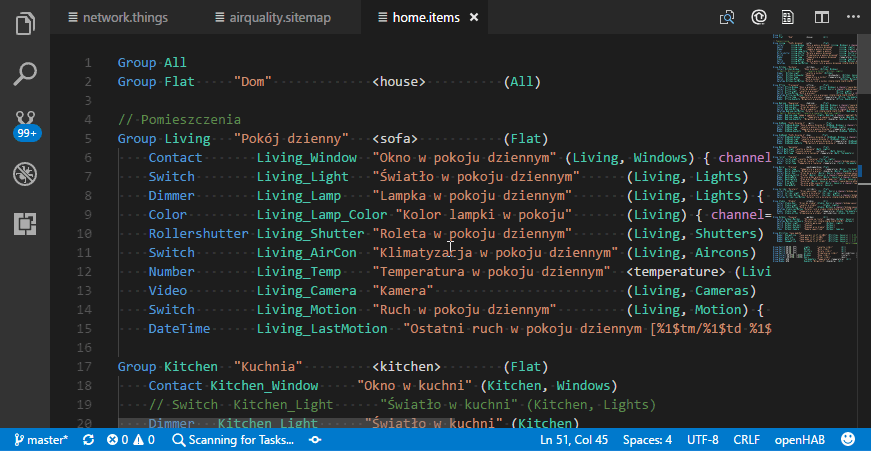

# openHAB VS Code Extension

[openHAB](http://www.openhab.org) is a vendor and techology agnostic open source automation software for your home. This [Visual Studio Code](https://code.visualstudio.com) extension allows you to work with openHAB configuration files (like `*.items`, `*.rules`, `*.sitemap` and `*.script`) thanks to the syntax highlighting, code snippets and integrated search.

The extension is designed with openHAB 2.x in mind - most snippets and design patterns will work in openHAB 2.x

## Features

* Code snippets for openHAB, including [Design Patterns](https://community.openhab.org/tags/designpattern) by Rich Koshak
* Syntax highlighting for the [openHAB DSL](http://docs.openhab.org/configuration/index.html) (rules, items, scripts and sitemaps).
* Integrated quick search of [openHAB Docs page](http://docs.openhab.org) (`Alt + Shift + O`)
* Integrated quick search of [openHAB Community](https://community.openhab.org)
* Integrated Basic UI browser window (`Ctrl + Alt + O` or editor title icon)


## Configuration

You are able to configure the hostname and port for the Sitemap preview.

* openhab.host (mandatory), default: openhabianpi
* openhab.port (optional), default: 8080

These settings should work fine on Windows machines and openHAB installations using the recommended [openHABian](http://docs.openhab.org/installation/openhabian.html) setup.
They should be edited if you use macOS or *NIX systems or manual openHAB installations.

To edit these settings, simply add overrides to either your user settings or your workspace settings in your Visual Studio Codes preferences.

For further informations on how to change your settings, visit the official [Visual Studio Code docs](https://code.visualstudio.com/docs/getstarted/settings).

### Configuration example (local)

````
{
	"openhab.host": "localhost"
	"openhab.port": "80"	
}
````

### Configuration example (macOS)

````
{
	"openhab.host": "openhabianpi.local"
	"openhab.port": "8080"	
}
````


## Sitemap preview with Basic UI

openHAB VS Code Extension allows you to preview the [sitemap structure](http://docs.openhab.org/configuration/sitemaps.html) in the [Basic UI](http://docs.openhab.org/addons/uis/basic/readme.html) running on your openHAB server instance.

If you have a sitemap file active in your editor and open Basic UI (`Ctrl + Alt + O` or editor title icon), you'll land directly on the sitemap you're working on.



You need to have openHAB server running in order to preview changes. The extension assumes that you access your openHAB config files from either:

Samba share (e.g. `\\OPENHABIANPI\openHAB-conf\`)
Local folder (e.g. `c:\openhab\configuration`)

## Known Issues

Check out [existing issues](https://github.com/openhab/openhab-vscode/issues) in the repository.

## Release Notes

### 0.0.1

Initial release of VS Code openHAB extension

----

### For More Information

* [openHAB Documentation](http://docs.openhab.org)
* [openHAB Community](https://community.openhab.org)

**Enjoy!**
