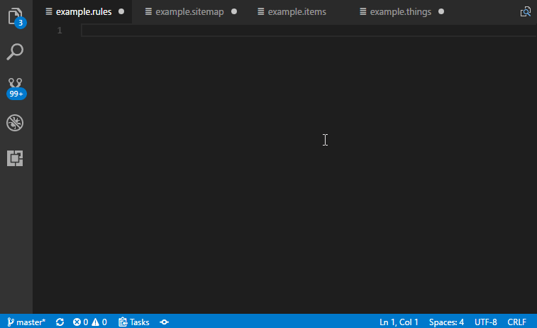
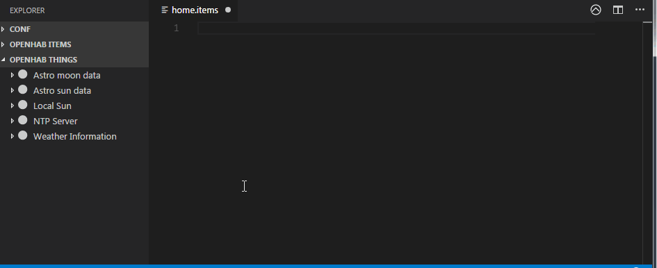
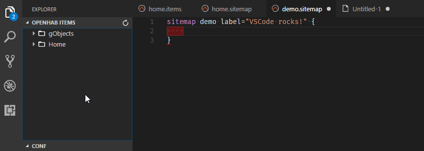

# openHAB VS Code Extension

[![Azure DevOps builds (branch)][ADOBuildBadgeImage]][ADOBuildBadgeImageLink]

[![Visual Studio Marketplace Downloads)][MarketplaceDownloadBadgeImage]][MarketplaceDownloadBadgeImageLink]
[![Open VSX Downloads][openVsxDownloadBadgeImage]][openVsxDownloadBadgeImageLink]

[openHAB](http://www.openhab.org) is a vendor and techology agnostic open source automation software for your home. This [Visual Studio Code](https://code.visualstudio.com) extension allows you to work with openHAB configuration files (like `*.items`, `*.rules`, `*.sitemap` and `*.script`) thanks to the syntax highlighting, code snippets and integrated search.

## Features

- Syntax highlighting for the [openHAB DSL](https://www.openhab.org/docs/configuration/) (rules, items, scripts and sitemaps).
- Code snippets for openHAB, including [Design Patterns](https://community.openhab.org/tags/designpattern) by Rich Koshak
- Integrated quick search of [openHAB Community](https://community.openhab.org)
- Integrated Basic UI browser window (`Ctrl + Alt + O` or editor title icon)
- Integration with openHAB REST API
- List of all Items accessible from the tree view
- Code completions
- Language Server Protocol support - syntax validation
- Dynamic Items creation from Thing's channels
- Quick openHAB console access
- Add Items to Sitemap with one click
- Get live Item states while hovering over item names in the Editor
- Show human readable `Thread::sleep()` times while hovering

## Configuration

Learn more about the configuration options in our [documentation](https://github.com/openhab/openhab-vscode/blob/master/docs/USAGE.md) on github.

## Things Explorer demo

## Sitemap Insert demo

## Known Issues

Check out [existing issues](https://github.com/openhab/openhab-vscode/issues) in the repository.

## Release Notes

See [CHANGELOG.md](https://github.com/openhab/openhab-vscode/blob/master/CHANGELOG.md) file for the details.

----

## Contributing

Everyone is invited to improve this extension.

Check out the extension code in our [GitHub repository](https://github.com/openhab/openhab-vscode/).
See [Contributing.md](https://github.com/openhab/openhab-vscode/blob/master/CONTRIBUTING.md) file for further technical and formal details for contributing something to the openHAB project.

### For More Information

- [openHAB Documentation](https://www.openhab.org/docs/)
- [openHAB Community](https://community.openhab.org)

**Enjoy!**

[ADOBuildBadgeImage]: https://img.shields.io/azure-devops/build/openhab/82e39b03-2e63-4a34-84ca-3cb57be32202/2/master?logo=azure-pipelines&logoColor=blue
[ADOBuildBadgeImageLink]: https://dev.azure.com/openhab/vscode-openhab/_build?definitionId=2

[MarketplaceDownloadBadgeImage]: https://img.shields.io/visual-studio-marketplace/d/openhab.openhab?logo=visual-studio-code&logoColor=blue
[MarketplaceDownloadBadgeImageLink]: https://marketplace.visualstudio.com/items?itemName=openhab.openhab

[openVsxDownloadBadgeImage]: https://img.shields.io/open-vsx/dt/openhab/openhab?label=Open%20VSX%20downloads&style=plastic
[openVsxDownloadBadgeImageLink]: https://open-vsx.org/extension/openhab/openhab
