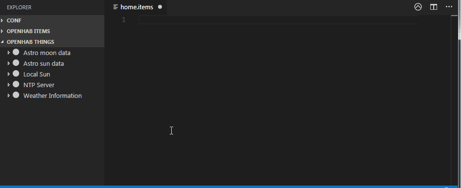

# openHAB VS Code Extension

[openHAB](http://www.openhab.org) is a vendor and techology agnostic open source automation software for your home. This [Visual Studio Code](https://code.visualstudio.com) extension allows you to work with openHAB configuration files (like `*.items`, `*.rules`, `*.sitemap` and `*.script`) thanks to the syntax highlighting, code snippets and integrated search.

The extension is designed with openHAB 2.x in mind - most snippets and design patterns will work in openHAB 2.x

## Features

* Syntax highlighting for the [openHAB DSL](https://www.openhab.org/docs/configuration/) (rules, items, scripts and sitemaps).
* Code snippets for openHAB, including [Design Patterns](https://community.openhab.org/tags/designpattern) by Rich Koshak
* Integrated quick search of [openHAB Community](https://community.openhab.org)
* Integrated Basic UI (or Classic UI) browser window (`Ctrl + Alt + O` or editor title icon)
* Integrated Paper UI preview for the Items and Things
* Integration with openHAB REST API
* List of all Items accessible from the tree view
* Code completions
* Language Server Protocol support - syntax validation
* Dynamic Items creation from Thing's channels
* Quick Karaf console access
* Add Items to Sitemap with one click

## Configuration

Learn more about the configuration options in our [documentation](https://github.com/openhab/openhab-vscode/blob/master/docs/USAGE.md) on github.

## Things Explorer demo

## Sitemap Insert demo

## Known Issues

Check out [existing issues](https://github.com/openhab/openhab-vscode/issues) in the repository.

## Release Notes

See [CHANGELOG.md](https://github.com/openhab/openhab-vscode/blob/master/CHANGELOG.md) file for the details.

----

### For More Information

* [openHAB Documentation](https://www.openhab.org/docs/)
* [openHAB Community](https://community.openhab.org)

**Enjoy!**
