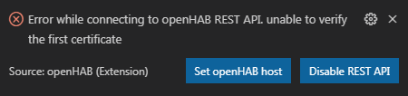

## Configuration

You are able to configure the hostname and port for the Sitemap preview.

* openhab.host (mandatory), default: openhabianpi
* openhab.port (optional), default: 8080

*openhab.host* will also work with the IP address of your openHAB instance, instead of the hostname.

These settings should work fine on Windows machines and openHAB installations using the recommended [openHABian](https://www.openhab.org/docs/installation/openhabian.html) setup.
They should be edited if you use macOS or &ast;NIX systems or manual openHAB installations.

To edit these settings, simply add overrides to either your user settings or your workspace settings in your Visual Studio Codes preferences.

For further informations on how to change your settings, visit the official [Visual Studio Code docs](https://code.visualstudio.com/docs/getstarted/settings).

### Configuration example (local)

```json
{
	"openhab.host": "localhost",
	"openhab.port": 80
}
```

### Configuration example (macOS)

```json
{
	"openhab.host": "openhabianpi.local",
	"openhab.port": 8080
}
```

### Integration with openHAB REST API

This VSCode extension connects to the openHAB REST API by default.
The connection is used to display list of Items in the left side tree view.
It's also utilized for code completions.

If you're using this extension just for the syntax highlighting
and don't want to involve the REST API, you can disable it by providing
the following parameter in your User Settings (`Ctrl + Shift + S`):

```
"openhab.useRestApi": false
```

You may need to reload the VSCode window to take effect.

### openHAB REST API and SSL Certificates

It generally is a good practise to secure connection to your openHAB using SSL/TLS. A key part with SSL is checking the certificate for validity ([which can be disabled](https://code.visualstudio.com/docs/setup/network#_ssl-certificates) - but this is in no way recommended and might be even more insecure than without SSL). VSCode's underlying [ELECTRON](https://electronjs.org/) framework does validation and uses OS's underlying certificate trust infrastructure. So if connecting to your openHAB instance works using your browser, in most cases REST API connection should work too. In some cases you might get this error message:



This is because the certificate itself might be valid but isn't signed by a root authority. It might have a certificate chain to root authority behind it which ELECTRON doesn't know of, so it rejects the certificate. So you have to configure your server to hand out complete certificate chain so ELECTRON will accept it.

There are two ways to do this, explained in following chapters. Restart your webserver and VSCode afterwards to apply these changes.

#### Getting Certificate Chain using Tools

If you have OpenSSL available (e.g. *Git Bash* has it), you can do a
```
openssl s_client -connect openhabianpi.local:8443 -showcerts
```
to show certificate chain. If you happen to have Firefox installed, you can use *Tools -> Page <u>I</u>nfo -> <u>S</u>ecurity -> [<u>V</u>iew Certificate]* to show certificate chain and about at middle of the page have a link ***Download** PEM (chain)* which includes coplete certificate chain.

Make sure that these certificates are correct ones (so you didn't fall for a man-in-the-middle) before setting the new certificate file on your webserver.

#### Setting up Certificate Chain Manually
Basically it's doing a
```
cat www.example.com.crt bundle.crt > www.example.com.chained.crt
```
and using ``www.example.com.chained.crt`` on your server as certificate. Make sure to chain certificates in the correct order, starting from certificate for your domain up to the certificate for your root authority.

Details can be found in [nginx documentation »Configuring HTTPS servers« chapter »SSL certificate chains«](https://nginx.org/en/docs/http/configuring_https_servers.html#chains)

## Validating the Rules

This extension comes with Language Server Protocol support.
Language servers allow you to add your own validation logic to files open in VS Code.
openHAB from version `openHAB 2.2.0 Build #1065` (SNAPSHOT) has the Language Server exposed on `5007` port.
openHAB 2.2 since build #1084 has LSP feature enabled in the runtime, so there are no additional steps for you to make it work.

In the unlikely case that your language server is running on a port other than the default one this is how it can be changed in the configuration:

```json
{
	"openhab.remoteLspPort": 5007
}
```

If you don't want to have your openHAB files validated by Language Server, simply disable it in the extension:
```json
{
	"openhab.remoteLspEnabled": false
}
```

## Accessing remote openHAB

Accessing remote openHAB from service like myopenhab is not possible, given that you need an access to the file system in order to read and write to the configuration files.
Although, you can access the Items and Things through the REST API.
Note that LSP (content assist for rules and syntax validation) won't be exposed, so you'll need to disable it too.

The following configuration will allow you to access REST API remotely:

```
    "openhab.host": "https://home.myopenhab.org",
    "openhab.port": 80,
    "openhab.remoteLspEnabled": false,
    "openhab.username": "your_myopenhab_email",
    "openhab.password": "your_myopenhab_password",
```

## Sitemap preview with Basic UI

openHAB VS Code Extension allows you to preview the [sitemap structure](https://www.openhab.org/docs/configuration/sitemaps.html) in the [Basic UI](https://www.openhab.org/docs/configuration/ui/basic/) running on your openHAB server instance.

If you have a sitemap file active in your editor and open Basic UI (`Ctrl + Alt + O` or editor title icon), you'll land directly on the sitemap you're working on.

You can optionally set `openhab.sitemapPreviewUI` parameter to `classicui` if you prefer Classic UI instead:
```json
{
	"openhab.sitemapPreviewUI": "classicui"
}
```


You need to have openHAB server running in order to preview changes. The extension assumes that you access your openHAB config files from either:

Samba share (e.g. `\\OPENHABIANPI\openHAB-conf\`)
Local folder (e.g. `c:\openhab\configuration`)

## Quick openHAB console access


This extension allows you to run openHAB console directly from the editor.
Note that you need to have:

* `ssh` installed on your environment
* Console exposed to the external interface
* `openhab.host` configuration parameter set properly

This feature allows you to modify the new param and e.g. show the openHAB logs immediately:

```
    "openhab.karafCommand": "ssh openhab@%openhabhost% -p 8101 -t 'log:tail'",
```
