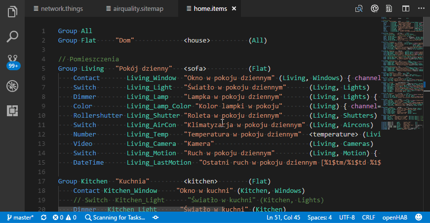
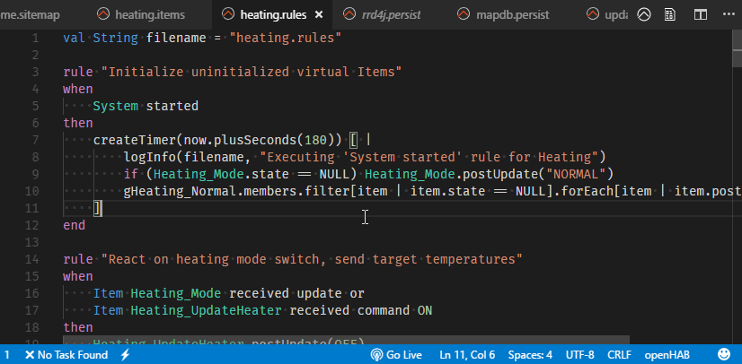

## Configuration

You are able to configure the hostname and port for the Sitemap preview.

* openhab.connection.host (mandatory), default: openhabianpi
* openhab.connection.port (optional), default: 8080

*openhab.host* will also work with the IP address of your openHAB instance, instead of the hostname.

These settings should work fine on Windows machines and openHAB installations using the recommended [openHABian](https://www.openhab.org/docs/installation/openhabian.html) setup.
They should be edited if you use macOS or &ast;NIX systems or manual openHAB installations.

To edit these settings, simply add overrides to either your user settings or your workspace settings in your Visual Studio Codes preferences.

For further informations on how to change your settings, visit the official [Visual Studio Code docs](https://code.visualstudio.com/docs/getstarted/settings).

### Configuration example (local)

```json
{
	"openhab.connection.host": "localhost",
	"openhab.connection.port": 80
}
```

### Configuration example (macOS)

```json
{
	"openhab.connection.host": "openhabianpi.local",
	"openhab.connection.port": 8080
}
```

### Integration with openHAB REST API

This VSCode extension connects to the openHAB REST API by default.
The connection is used to display list of Items in the left side tree view.
It's also utilized for code completions.

If you're using this extension just for the syntax highlighting
and don't want to involve the REST API, you can disable it by providing
the following parameter in your User Settings (`Ctrl + Shift + S`):

```
"openhab.connection.useRestApi": false
```

You may need to reload the VSCode window to take effect.

## Validating the Rules

This extension comes with Language Server Protocol support.
Language servers allow you to add your own validation logic to files open in VS Code.
openHAB from version `openHAB 2.2.0 Build #1065` (SNAPSHOT) has the Language Server exposed on `5007` port.
openHAB 2.2 since build #1084 has LSP feature enabled in the runtime, so there are no additional steps for you to make it work.

In the unlikely case that your language server is running on a port other than the default one this is how it can be changed in the configuration:

```json
{
	"openhab.remoteLsp.port": 5007
}
```

If you don't want to have your openHAB files validated by Language Server, simply disable it in the extension:
```json
{
	"openhab.remoteLsp.enabled": false
}
```

## Accessing remote openHAB

Accessing remote openHAB from service like myopenhab is not possible, given that you need an access to the file system in order to read and write to the configuration files.
Although, you can access the Items and Things through the REST API.
Note that LSP (content assist for rules and syntax validation) won't be exposed, so you'll need to disable it too.

The following configuration will allow you to access REST API remotely:

```
    "openhab.connection.host": "https://home.myopenhab.org",
    "openhab.connection.port": 80,
    "openhab.remoteLsp.enabled": false,
    "openhab.basicAuth.userName": "your_myopenhab_email",
    "openhab.basicAuth.password": "your_myopenhab_password",
```

## Sitemap preview with Basic UI

openHAB VS Code Extension allows you to preview the [sitemap structure](https://www.openhab.org/docs/configuration/sitemaps.html) in the [Basic UI](https://www.openhab.org/docs/configuration/ui/basic/) running on your openHAB server instance.

If you have a sitemap file active in your editor and open Basic UI (`Ctrl + Alt + O` or editor title icon), you'll land directly on the sitemap you're working on.

You can optionally set `openhab.sitemapPreviewUI` parameter to `classicui` if you prefer Classic UI instead:
```json
{
	"openhab.sitemapPreviewUI": "classicui"
}
```



You need to have openHAB server running in order to preview changes. The extension assumes that you access your openHAB config files from either:

Samba share (e.g. `\\OPENHABIANPI\openHAB-conf\`)
Local folder (e.g. `c:\openhab\configuration`)

## Quick openHAB console access



This extension allows you to run openHAB console directly from the editor.
Note that you need to have:

* `ssh` installed on your environment
* Console exposed to the external interface
* `openhab.connection.host` configuration parameter set properly

This feature allows you to modify the new param and e.g. show the openHAB logs immediately:

```
    "openhab.consoleCommand": "ssh openhab@%openhabhost% -p 8101 -t 'log:tail'",
```
